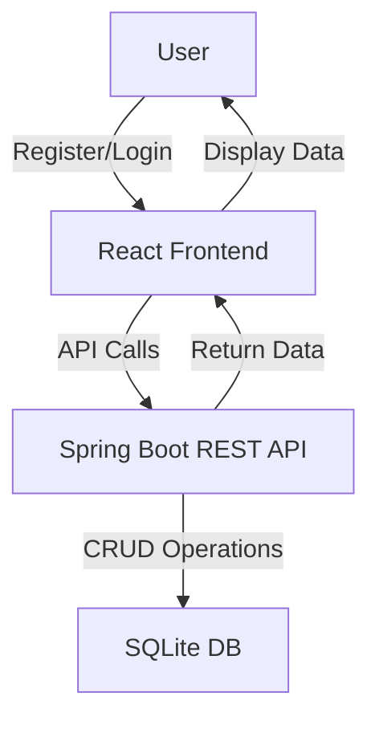

# High-Level Design Document for Contact Management System (CMS)

## 1. System Architecture Overview

The Contact Management System (CMS) consists of three main components: the backend, frontend, and database. The backend is built using Spring Boot, providing a RESTful API for the frontend to interact with. The frontend is developed using React, offering a user-friendly interface for managing contacts and companies. The SQLite database serves as the persistent storage for user, contact, and company data.

```
+-------------------+          +-------------------+
|                   |          |                   |
|   React Frontend  | <------> | Spring Boot REST  |
|                   |          |       API         |
+-------------------+          +-------------------+
                                   |
                                   |
                                   v
                          +-------------------+
                          |                   |
                          |    SQLite DB      |
                          |                   |
                          +-------------------+
```

## 2. Component Interaction Diagram



## 3. Data Flow Diagram

```plaintext
+-------------------+
|                   |
|       User       |
|                   |
+---------+---------+
          |
          | 1. Register/Login
          v
+---------+---------+
|                   |
|   React Frontend  |
|                   |
+---------+---------+
          |
          | 2. API Calls
          v
+---------+---------+
|                   |
| Spring Boot REST  |
|       API         |
|                   |
+---------+---------+
          |
          | 3. CRUD Operations
          v
+---------+---------+
|                   |
|    SQLite DB      |
|                   |
+-------------------+
```

## 4. Technology Stack Justification

- **Backend**: Spring Boot
  - Provides a robust framework for building RESTful APIs with built-in support for security, data access, and dependency injection.
  
- **Frontend**: React
  - A popular JavaScript library for building user interfaces, allowing for a responsive and dynamic user experience.

- **Database**: SQLite
  - A lightweight, serverless database that is easy to set up and manage, making it ideal for small to medium-sized applications.

## 5. ER Diagram for Data Models

```plaintext
+----------------+       +----------------+       +----------------+
|     User       |       |    Contact     |       |    Company     |
+----------------+       +----------------+       +----------------+
| user_id (PK)   |<----->| contact_id (PK)|       | company_id (PK)|
| username        |       | user_id (FK)   |<----->| name           |
| password_hash   |       | name            |       | address        |
| email           |       | email           |       | phone          |
| created_at      |       | phone           |       | created_at     |
| updated_at      |       | company_id (FK) |       | updated_at     |
+----------------+       | created_at      |       +----------------+
                         | updated_at      |
                         +----------------+
```

## 6. API Layer Design

### Endpoints

- **User Management**
  - `POST /api/users/register`: Register a new user
  - `POST /api/users/login`: Authenticate a user
  - `GET /api/users/{id}`: Get user profile
  - `PUT /api/users/{id}`: Update user profile
  - `POST /api/users/reset-password`: Reset user password

- **Contact Management**
  - `POST /api/contacts`: Create a new contact
  - `GET /api/contacts`: Retrieve all contacts
  - `GET /api/contacts/{id}`: Retrieve a specific contact
  - `PUT /api/contacts/{id}`: Update a contact
  - `DELETE /api/contacts/{id}`: Delete a contact

- **Company Management**
  - `POST /api/companies`: Create a new company
  - `GET /api/companies`: Retrieve all companies
  - `GET /api/companies/{id}`: Retrieve a specific company
  - `PUT /api/companies/{id}`: Update a company
  - `DELETE /api/companies/{id}`: Delete a company

## 7. Deployment Architecture

The deployment architecture consists of the following components:

```
+-------------------+
|                   |
|   Load Balancer   |
|                   |
+---------+---------+
          |
          v
+---------+---------+
|                   |
|   Application     |
|   Server (Spring) |
|                   |
+---------+---------+
          |
          v
+---------+---------+
|                   |
|   SQLite Database |
|                   |
+-------------------+
```

### Deployment Considerations
- **Load Balancer**: Distributes incoming requests to multiple instances of the Spring Boot application for scalability.
- **Application Server**: Hosts the Spring Boot application, handling API requests and business logic.
- **Database**: SQLite database for data persistence, which can be hosted on the same server or separately depending on the scale.

This high-level design document provides a comprehensive overview of the architecture, components, and interactions within the Contact Management System, ensuring a clear understanding of the system's structure and functionality.