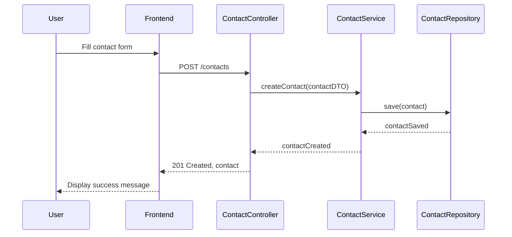
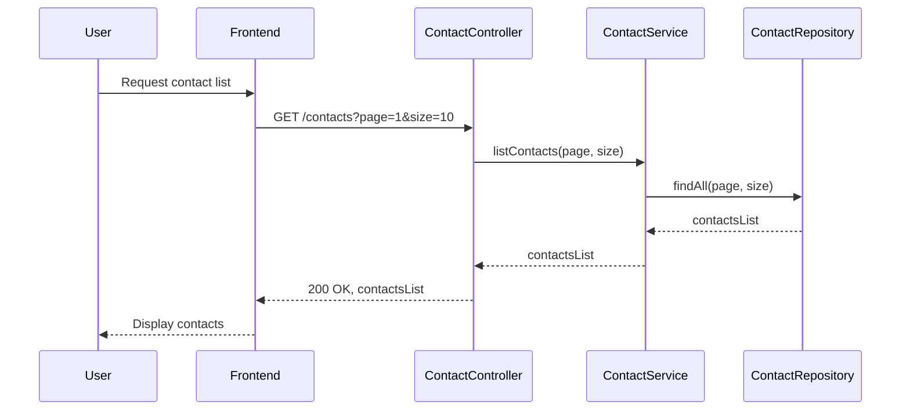
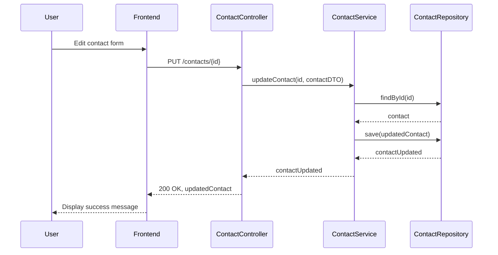
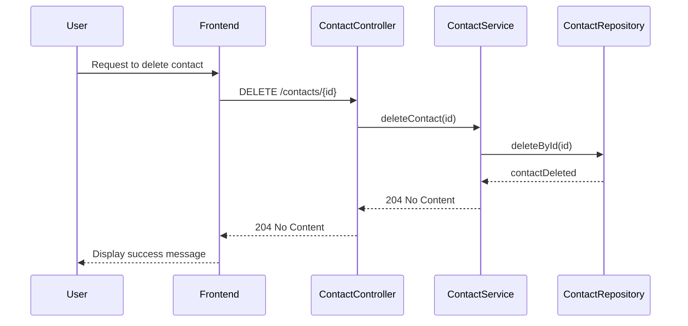
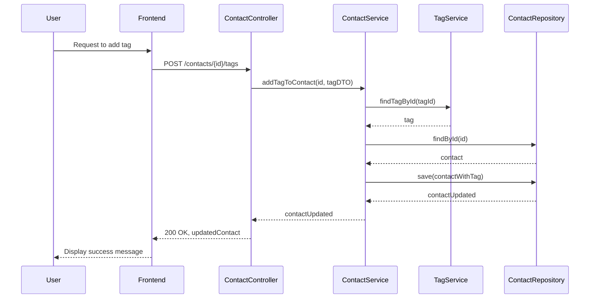
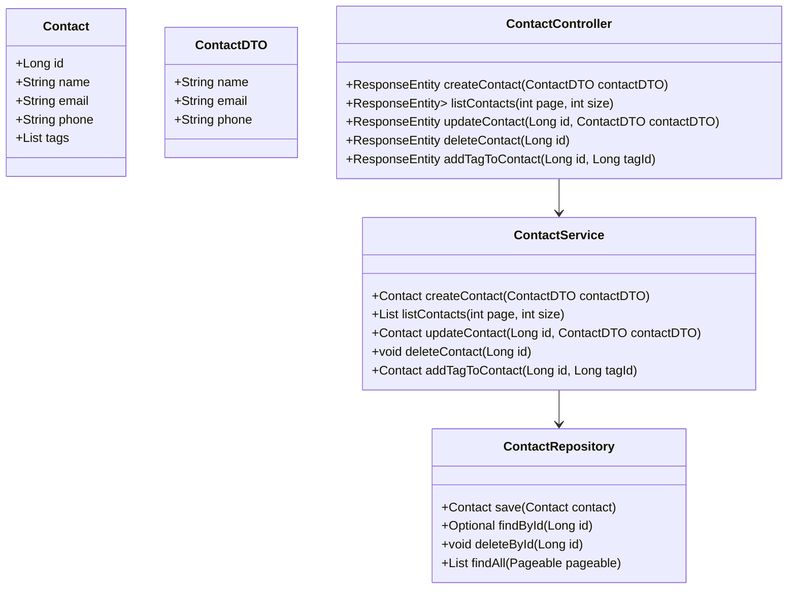
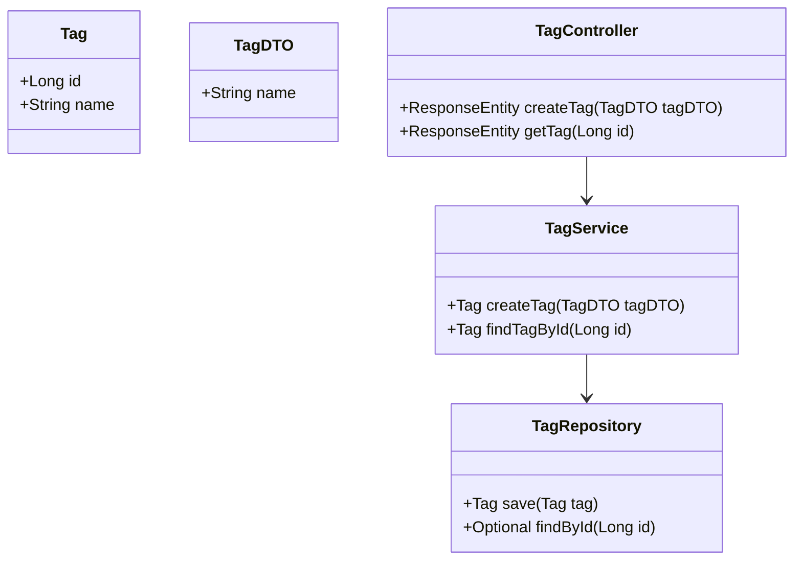
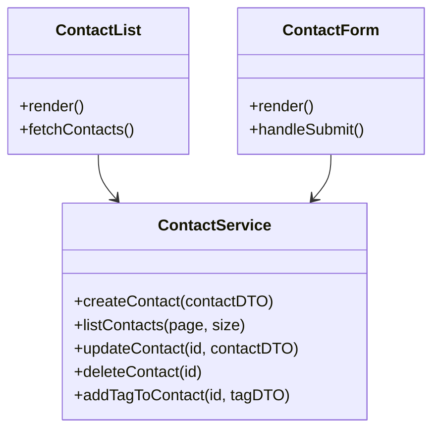

# Low-Level Design for Contact Management System (CMS)

## 1. Detailed Sequence Diagrams

### Create Contact Flow


### List Contacts with Pagination


### Update Contact


### Delete Contact


### Add Tag to Contact


## 2. Detailed Class Diagrams

### Contact Class Diagram


### Tag Class Diagram


### Frontend Components Class Diagram


## 3. Module Structure and Package Organization
```
com.example.cms
├── controller
│   ├── ContactController.java
│   └── TagController.java
├── service
│   ├── ContactService.java
│   └── TagService.java
├── repository
│   ├── ContactRepository.java
│   └── TagRepository.java
├── model
│   ├── Contact.java
│   ├── ContactDTO.java
│   ├── Tag.java
│   └── TagDTO.java
└── exception
    ├── ResourceNotFoundException.java
    └── GlobalExceptionHandler.java
```

## 4. Complete Database Schema with SQL DDL
```sql
CREATE TABLE contacts (
    id INTEGER PRIMARY KEY AUTOINCREMENT,
    name TEXT NOT NULL,
    email TEXT NOT NULL UNIQUE,
    phone TEXT
);

CREATE TABLE tags (
    id INTEGER PRIMARY KEY AUTOINCREMENT,
    name TEXT NOT NULL UNIQUE
);

CREATE TABLE contact_tags (
    contact_id INTEGER,
    tag_id INTEGER,
    PRIMARY KEY (contact_id, tag_id),
    FOREIGN KEY (contact_id) REFERENCES contacts(id),
    FOREIGN KEY (tag_id) REFERENCES tags(id)
);
```

## 5. Detailed API Endpoint Specifications

### Create Contact
- **Path**: `/contacts`
- **Method**: `POST`
- **Parameters**: 
  - Body: `ContactDTO`
- **Request Schema**:
```json
{
  "name": "John Doe",
  "email": "john.doe@example.com",
  "phone": "1234567890"
}
```
- **Response Schema**:
```json
{
  "id": 1,
  "name": "John Doe",
  "email": "john.doe@example.com",
  "phone": "1234567890",
  "tags": []
}
```
- **HTTP Status Codes**: 
  - 201 Created
  - 400 Bad Request (if validation fails)

### List Contacts
- **Path**: `/contacts`
- **Method**: `GET`
- **Parameters**: 
  - Query: `page`, `size`
- **Response Schema**:
```json
{
  "content": [
    {
      "id": 1,
      "name": "John Doe",
      "email": "john.doe@example.com",
      "phone": "1234567890",
      "tags": []
    }
  ],
  "totalPages": 1,
  "totalElements": 1
}
```
- **HTTP Status Codes**: 
  - 200 OK

### Update Contact
- **Path**: `/contacts/{id}`
- **Method**: `PUT`
- **Parameters**: 
  - Path: `id`
  - Body: `ContactDTO`
- **Request Schema**: Same as Create Contact
- **Response Schema**: Same as Create Contact
- **HTTP Status Codes**: 
  - 200 OK
  - 404 Not Found (if contact does not exist)

### Delete Contact
- **Path**: `/contacts/{id}`
- **Method**: `DELETE`
- **Parameters**: 
  - Path: `id`
- **HTTP Status Codes**: 
  - 204 No Content
  - 404 Not Found (if contact does not exist)

### Add Tag to Contact
- **Path**: `/contacts/{id}/tags`
- **Method**: `POST`
- **Parameters**: 
  - Path: `id`
  - Body: `TagDTO`
- **Request Schema**:
```json
{
  "name": "Friend"
}
```
- **Response Schema**: Same as Update Contact
- **HTTP Status Codes**: 
  - 200 OK
  - 404 Not Found (if contact or tag does not exist)

## 6. Validation Rules and Constraints
- **Contact**:
  - `name`: Not null, max length 100
  - `email`: Not null, must be a valid email format, unique
  - `phone`: Optional, max length 15
- **Tag**:
  - `name`: Not null, unique, max length 50

## 7. Error Handling Strategy
- Use a global exception handler to catch exceptions and return appropriate HTTP status codes and messages.
- Custom exceptions for resource not found, validation errors, etc.

## 8. Security Considerations
- Implement authentication (e.g., JWT) for API access.
- Validate user input to prevent SQL injection and XSS attacks.
- Use HTTPS for secure data transmission.
- Implement role-based access control if needed (e.g., admin vs. user permissions). 

This low-level design provides a comprehensive overview of the Contact Management System, detailing the interactions, data structures, and architectural considerations necessary for implementation.